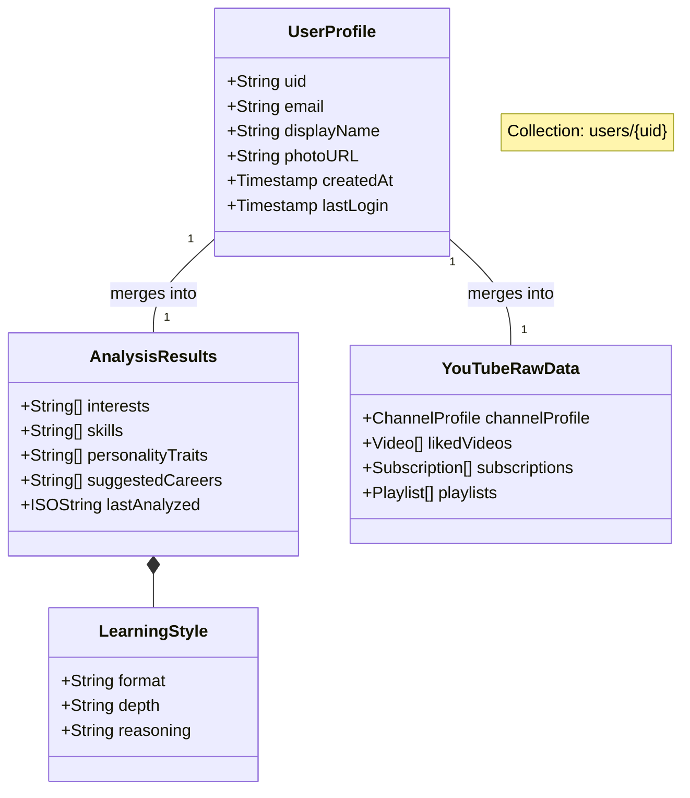

# Project Analysis & UML Diagrams

## Requirement Analysis

**Non-Functional Requirements:**
*   **Performance**: Fast and efficient response time.
*   **Scalability**: Supports many users easily.
*   **Reliability**: Works consistently without failure.
*   **Usability**: Easy and simple to use.
*   **Security**: Keeps user data safe.
*   **Maintainability**: Easy to update and fix.
*   **Portability**: Runs on all devices.
*   **Accessibility**: Inclusive for all learners.

## Computational Resources

### Hardware Requirements
*   **Processor**: Intel i5
*   **RAM**: 8 GB or higher
*   **SSD Card**: 512 GB

### Software Requirements
*   **Frontend**: React.js
*   **Backend**: Python Flask, Firebase Cloud Functions
*   **Database**: Firebase Firestore
*   **AI Libraries**: NLP Libraries, Machine Learning Models
*   **Operating System**: Windows 10
*   **IDE/Tools**: VS Code, Firebase Console

## 1. Project Overview
**Lernova** is a Next.js web application designed to analyze a user's digital footprint (starting with YouTube) to generate personalized learning insights and career path suggestions using AI.

### Tech Stack
- **Frontend**: Next.js 14 (App Router), React, Tailwind CSS, Lucide Icons.
- **Backend/Services**: Firebase Authentication (Google Auth), Firebase Firestore (Database).
- **AI**: Google Gemini 1.5 Pro (via `@google/generative-ai`).
- **Data Integration**: YouTube Data API v3.

---

## 2. High-Level System Architecture
This diagram illustrates how the frontend interacts with external services to deliver the core functionality.

```mmd
graph TD
    %% Styling
    classDef frontend fill:#e1f5fe,stroke:#01579b,stroke-width:2px;
    classDef firebase fill:#fff3e0,stroke:#e65100,stroke-width:2px;
    classDef google fill:#e8f5e9,stroke:#1b5e20,stroke-width:2px;
    classDef storage fill:#f3e5f5,stroke:#4a148c,stroke-width:2px;

    User([User])

    subgraph "Lernova Web App (Next.js)"
        UI[Frontend UI]:::frontend
        AuthContext[Auth Context]:::frontend
        Logic[Business Logic / Services]:::frontend
    end

    subgraph "Firebase Cloud"
        FirebaseAuth[Authentication]:::firebase
        Firestore[(Firestore DB)]:::storage
    end

    subgraph "Google Services"
        YTAPI[YouTube Data API]:::google
        GeminiAPI[Gemini AI Model]:::google
    end

    User -->|Visits| UI
    UI -->|Login| AuthContext
    AuthContext -->|Google Sign-In| FirebaseAuth
    
    UI -->|Request Analysis| Logic
    Logic -->|Fetch Data| YTAPI
    Logic -->|Generate Profile| GeminiAPI
    
    Logic -->|Read/Write User Data| Firestore
    UI -->|Display Dashboard| Logic
```

---

## 3. Core Feature Flow: "Analyze Footprint"
This flowchart details the step-by-step process when a user clicks "Connect YouTube" to analyze their profile.

```mmd
flowchart TD
    %% Nodes
    Start([User Clicks 'Connect YouTube']) --> AuthCheck{Is User Logged In?}
    
    AuthCheck -- No --> Login[Trigger Google Popup Login]
    Login --> LoginSuccess{Success?}
    LoginSuccess -- No --> Err1([Show Error Message])
    LoginSuccess -- Yes --> GetToken
    
    AuthCheck -- Yes --> GetToken[Get Google Access Token]
    
    GetToken --> FetchData[Fetch YouTube Data]
    
    subgraph "Data Aggregation (youtube.js)"
        FetchData -->|API Call| Liked[Liked Videos]
        FetchData -->|API Call| Subs[Subscriptions]
        FetchData -->|API Call| Playlists[Playlists]
        FetchData -->|API Call| Channel[Channel Profile]
    end
    
    Liked & Subs & Playlists & Channel --> Normalize[Normalize & Format Data]
    
    Normalize --> SaveDB[(Save Raw Data to Firestore)]
    
    SaveDB --> TriggerAI[Trigger Gemini Analysis]
    
    subgraph "AI Processing (gemini.js)"
        TriggerAI --> Prompt[Construct Contextual Prompt]
        Prompt --> CallGemini[Call Gemini 1.5 Pro]
        CallGemini --> Parse[Parse JSON Response]
    end
    
    Parse --> UpdateDB[(Update User Profile in Firestore)]
    UpdateDB -- Interests, Skills, Careers --> Display[Display Insights Dashboard]
```

---

## 4. Component & File Structure
A map of the key files in the `src` directory and their responsibilities.

```mmd
classDiagram
    class AppLayout {
        +layout.js
        +globals.css
    }
    class HomePage {
        +page.js
    }
    class AnalyzePage {
        +page.js (Logic Heavy)
        -connectYouTube()
    }
    class ChatPage {
        +page.js (Mock UI)
        -messages State
    }
    class Services {
        +firebase.js
        +auth.js
        +gemini.js
        +youtube.js
    }
    class Components {
        +Navbar.js
        +Dashboard.js
    }

    AppLayout --> HomePage
    AppLayout --> AnalyzePage
    AppLayout --> ChatPage
    
    AnalyzePage ..> Services : Uses youtube.js, gemini.js
    AnalyzePage ..> Components : Uses Navbar
    ChatPage ..> Components : Uses Navbar
```

---

## 5. Mermaid Live Editor Code
Copy and paste the code below into the [Mermaid Live Editor](https://mermaid.live/) to generate the diagrams.

### **Detailed Analysis Flowchart (Ready for Editor)**

```mermaid
flowchart TD
    %% Nodes and Styles
    style Start fill:#2ecc71,stroke:#27ae60,color:white
    style Error fill:#e74c3c,stroke:#c0392b,color:white
    style DB fill:#3498db,stroke:#2980b9,color:white,shape:cylinder
    style AI fill:#9b59b6,stroke:#8e44ad,color:white

    Start([User Starts Analysis]) --> CheckToken{Has Access Token?}
    
    CheckToken -- No --> Auth["Authenticate (Google Popup)"]
    Auth --> CheckSuccess{Auth Success?}
    CheckSuccess -- No --> Error([Show Connection Error])
    CheckSuccess -- Yes --> FetchAPI
    CheckToken -- Yes --> FetchAPI
    
    subgraph "Data Collection"
        FetchAPI[Fetch YouTube Data]
        FetchAPI -->|GET| Liked[Liked Videos]
        FetchAPI -->|GET| Subs[Subscriptions]
        
        Liked --> Format[Format Data]
        Subs --> Format
    end
    
    Format --> SaveRaw[Save Raw Data]
    SaveRaw --> DB[(Firestore: users/{uid})]
    
    subgraph "Intelligence Layer"
        DB -->|Read Data| GenPrompt[Generate Prompt]
        GenPrompt -->|Send to| Gemini[Gemini Play (1.5 Pro)]
        Gemini -->|Returns JSON| Analysis[Analysis Result]
        
        Analysis -->|Extract| A1[Skills]
        Analysis -->|Extract| A2[Interests]
        Analysis -->|Extract| A3[Careers]
    end
    
    A1 & A2 & A3 --> UpdateProfile[Update User Profile]
    UpdateProfile --> DB
    UpdateProfile --> Finish([Render Insights UI])
```

---

## 6. Firestore Database Schema

The application uses a **NoSQL** document structure in Firebase Firestore.
The primary collection is `users`, indexed by the user's `uid`.

### Collection: `users`
**Document ID**: `uid` (Auth User ID)

```mmd
classDiagram
    class UserDocument {
        +String uid
        +String email
        +String displayName
        +String photoURL
        +Timestamp createdAt
        +Timestamp lastLogin
        +Boolean onboardingComplete
        +Object progress
        +Object youtubeData
        +String lastAnalyzed
        +String[] interests
        +String[] skills
        +Object learningStyle
        +String[] personalityTraits
        +String[] suggestedCareers
    }

    class YouTubeData {
        +Object channelProfile
        +Object[] likedVideos
        +Object[] subscriptions
        +Object[] playlists
    }

    class LearningStyle {
        +String format
        +String depth
        +String reasoning
    }

    UserDocument *-- YouTubeData : contains
    UserDocument *-- LearningStyle : contains
```

### Visual Schema (Ready for Mermaid Live Editor)



---

## 7. Deployment Strategy & Configuration

The project is configured for **Firebase Hosting** using a static export from Next.js.

### Build Process
1.  **Next.js Config**: `output: 'export'` (implied by `firebase.json` pointing to `out` folder).
2.  **Build Command**: `npm run build` -> Generates static HTML/JS/CSS in `out/`.
3.  **Deploy Command**: `firebase deploy` -> Uploads `out/` to Firebase Hosting CDN.

### Environment Variables
The application requires the following keys in `.env.local` to function:

| Variable | Description |
| :--- | :--- |
| `NEXT_PUBLIC_FIREBASE_API_KEY` | Firebase Project API Key |
| `NEXT_PUBLIC_FIREBASE_AUTH_DOMAIN` | Auth Domain (e.g., `proj-id.firebaseapp.com`) |
| `NEXT_PUBLIC_FIREBASE_PROJECT_ID` | Project ID (used for Firestore refs) |
| `NEXT_PUBLIC_GEMINI_API_KEY` | Google AI Studio Key for Gemini 1.5 Pro |

---

## 8. Future Roadmap & Technical Debt

### Pending Features (Mocked in UI)
1.  **Resume Analysis**:
    *   **Current State**: UI Placeholder in `analyze/page.js`.
    *   **Goal**: Parse PDF/Docx resumes to extract "Hard Skills" and map to YouTube learning gaps.
2.  **AI Mentorship Chat**:
    *   **Current State**: Fully mocked in `chat/page.js` (static messages & roadmap).
    *   **Goal**: Implement RAG (Retrieval-Augmented Generation) using the user's generated profile as context for the chat bot.
3.  **Analysis Results UI**:
    *   **Current State**: Data (Skills, Interests, Careers) is saved to Firestore but *not displayed* in `insights/page.js`. The Insights page currently only shows raw YouTube stats.
    *   **Goal**: Create UI components to visualize the Gemini-generated profile (e.g., Radar charts for skills, Career cards).

### Security Implementation
*   **Firestore Rules**: Currently undefined in repository.
    *   *Action Item*: Create `firestore.rules` to ensure users can only read/write their own documents (`request.auth.uid == userId`).


